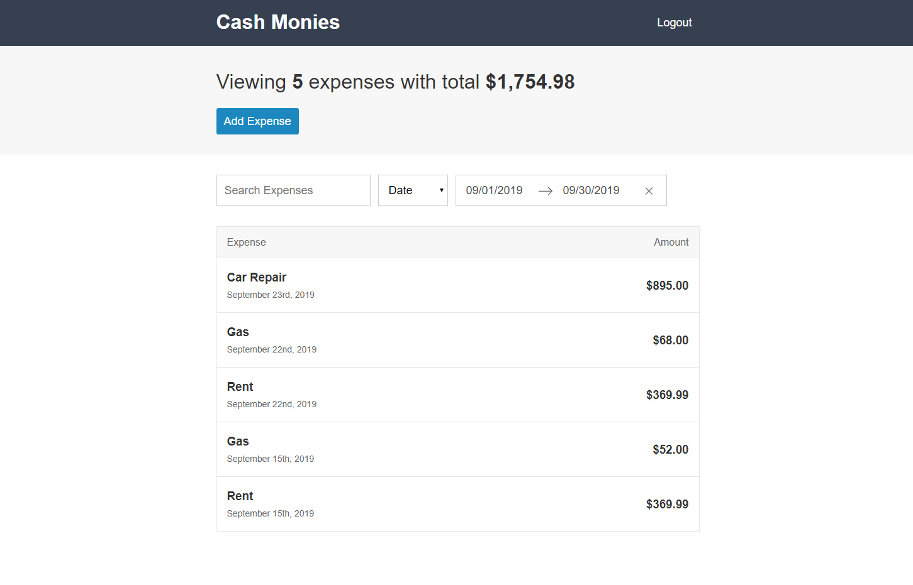
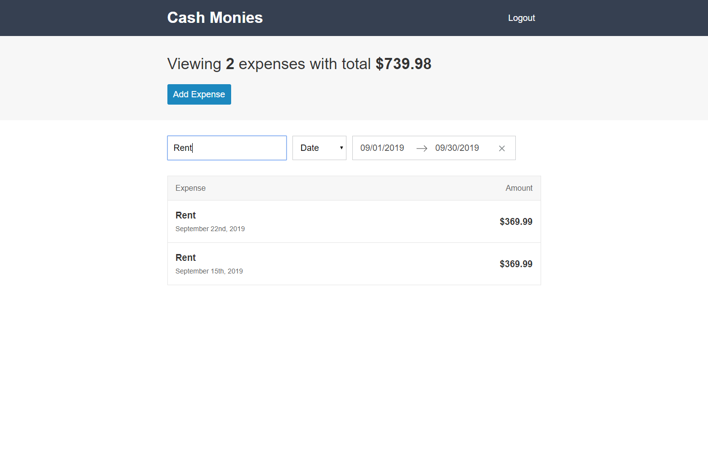
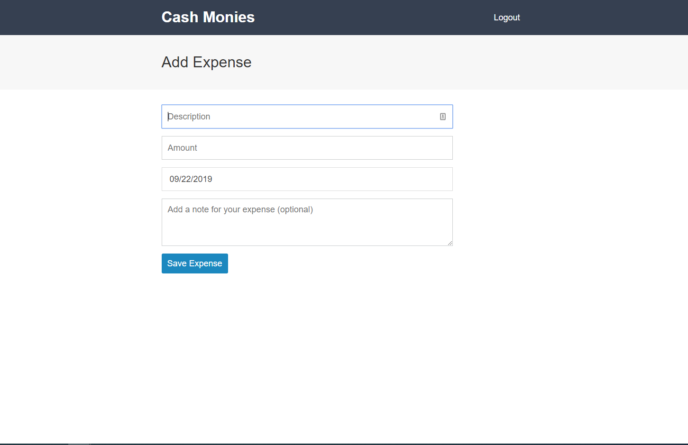
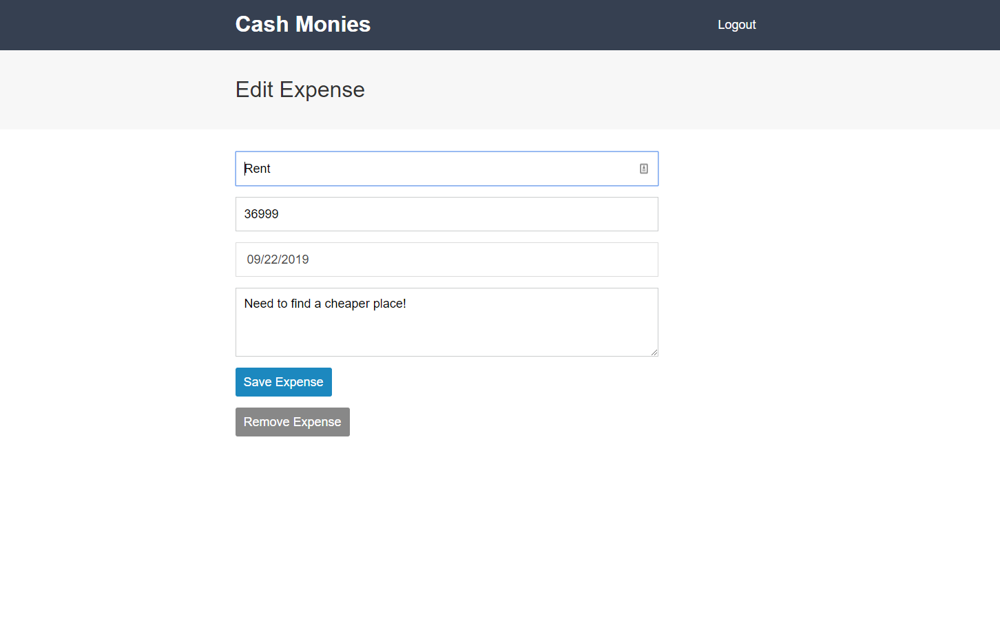

[](https://circleci.com/gh/IanGlass/cash-monies/tree/master) [](https://codecov.io/gh/IanGlass/cash-monies) [](https://opensource.org/licenses/Apache-2.0)

# cash-monies
cash-monies is a budgetting app that allows you to store and manage a persistent list of expenses including a title, the amount, the date and an optional note.

https://cash-monies.herokuapp.com/

## Login
Logging in can currently only be achieved using Google OAuth, which will automatically fetch expense data related to your Google profile.
<p align="center">

</p>

<details>
<summary>LoginPage</summary>
The LoginPage consists of a relatively simple stateless functional component, which uses a startLogin functional action generator to prompt a Google OAuth modal.

```javascript
export const LoginPage = (props) => (
  <div className="box-layout">
    <div className="box-layout__box">
      <h1 className="box-layout__title">Cash Monies</h1>
      <p>It's time to get your expenses under control</p>
      <button className="button" onClick={props.startLogin}>Login with Google</button>
    </div>
  </div>
)

const mapDispatchToProps = (dispatch) => ({
  startLogin: dispatch(startLogin)
});

export default connect(undefined, mapDispatchToProps)(LoginPage);
```

auth.js
```javascript
export const startLogin = () => {
  return () => {
    return firebase.auth().signInWithPopup(googleAuthProvider);
  }
}
```
</details>

## Dashboard

<p align="center">


</p>

<details>
<summary>LoadingPage</summary>
The LoadingPage consists of a spinner gif exported as a stateless functional component and is the first component to be rendered. Once the firebase `onAuthStateChange` event listener is triggered, the AppRouter will be rendered, taking a logged in user to the dashboard.

```javascript
const LoadingPage = () => (
  <div className="loader">
    
  </div>
);

export default LoadingPage;
```

app.js
```javascript
const jsx = (
  <Provider store={store}>
    <AppRouter />
  </Provider>
);

let hasRendered = false;
const renderApp = () => {
  if (!hasRendered) {
    ReactDOM.render(jsx, document.getElementById('app'));
    hasRendered = true;
  }
}

ReactDOM.render(<LoadingPage />, document.getElementById('app'));

firebase.auth().onAuthStateChanged((user) => {
  // Log user out
  if (!user) {
    store.dispatch(logout());
    renderApp();
    return history.push('/');
  }
  store.dispatch(login(user.uid));
  // Log user in
  // Wait until expenses are loaded from DB before rendering application
  store.dispatch(startSetExpenses())
  .then(() => {
    renderApp();
    if (history.location.pathname === '/') {
      return history.push('/dashboard');
    }
  });
});
```
</details>

<details>
<summary>Header</summary>
The header component contains two "links", one returns to the dashboard and one begins the logout action and re-directs the user to the login page.

```javascript
export const Header = (props) => (
  <header className="header">
    <div className="content-container">
      <div className="header__content">
        <Link className="header__title" to="/dashboard">
          <h1>Cash Monies</h1>
        </Link>
        <button className="button button--link" onClick={props.startLogout}>Logout</button>
      </div>
    </div>
  </header>
);

const mapDispatchToProps = (dispatch) => ({
  startLogout: dispatch(startLogout)
});

export default connect(undefined, mapDispatchToProps)(Header);
```

auth.js

```javascript
export const startLogout = () => {
  return () => {
    return firebase.auth().signOut();
  }
}
```
</details>

<details>
<summary>ExpenseDashboardPage</summary>
A container component.

```javascript
const ExpenseDashboardPage = () => (
  <div>
    <ExpensesSummary />
    <ExpenseListFilters />
    <ExpenseList />
  </div>
);

export default ExpenseDashboardPage;
```
</details>

<details>
<summary>ExpensesSummary</summary>
Shows a summary of expenses which are currently viewed, filtered results will not contribute to summary information. Information on filtered expenses is processed by two selectors, expensesTotal and getVisibleExpenses.

```javascript
export const ExpensesSummary = (props) => (
  <div className="page-header">
    <div className="content-container">
      <h1 className="page-header__title">Viewing <span>{props.expensesCount}</span> {props.expensesCount === 1 ? 'expense' : 'expenses'} with total <span>{numeral(props.expensesTotal / 100).format('$0,0.00')}</span></h1>
      <div className="page-header__actions">
        <Link to="/create" className="button">Add Expense</Link>
      </div>
    </div>
  </div>
);

const mapStateToProps = (state) => ({
  expensesTotal: expensesTotal(getVisibleExpenses(state.expenses, state.filters)),
  expensesCount: getVisibleExpenses(state.expenses, state.filters).length
})

export default connect(mapStateToProps)(ExpensesSummary);
```
</details>

<details>
<summary>ExpenseListFilters</summary>
Views the currently applied list of filters and sets them in the Redux global store.

```javascript
export class ExpenseListFilters extends React.Component {
  state = {
    calendarFocused: null,
  }
  onDatesChange = ({ startDate, endDate }) => {
    this.props.setStartDate(startDate);
    this.props.setEndDate(endDate);
  }
  onFocusChange = (calendarFocused) => {
    this.setState(() => ({ calendarFocused }));
  }
  onTextChange = (e) => {
    this.props.setTextFilter(e.target.value);
  }
  onSortChange = (e) => {
    if (e.target.value === 'date') {
      this.props.sortByDate();
    } else if (e.target.value === 'amount') {
      this.props.sortByAmount();
    }
  }
  render() {
    return (
      <div className="content-container">
        <div className="input-group">
          <div className="input-group__item">
            <input
              className="text-input"
              placeholder="Search Expenses"
              type="text"
              value={this.props.filters.text}
              onChange={this.onTextChange}
            />
          </div>
          <div className="input-group__item">
            <select
              className="select"
              value={this.props.filters.sortBy}
              onChange={this.onSortChange}
            >
              <option value="date">Date</option>
              <option value="amount">Amount</option>
            </select>
          </div>
          <div className="input-group__item">
            <DateRangePicker
              startDate={this.props.filters.startDate}
              endDate={this.props.filters.endDate}
              onDatesChange={this.onDatesChange}
              focusedInput={this.state.calendarFocused}
              onFocusChange={this.onFocusChange}
              showClearDates={true}
              numberOfMonths={1}
              isOutsideRange={() => false}
            />
          </div>
        </div>
      </div>
    )
  }
}

const mapStateToProps = (state) => ({
  filters: state.filters
});

const mapDispatchToProps = (dispatch) => ({
  setTextFilter: (text) => dispatch(setTextFilter(text)),
  sortByDate: () => dispatch(sortByDate()),
  sortByAmount: () => dispatch(sortByAmount()),
  setStartDate: (startDate) => dispatch(setStartDate(startDate)),
  setEndDate: (endDate) => dispatch(setEndDate(endDate))
})

export default connect(mapStateToProps, mapDispatchToProps)(ExpenseListFilters);
```
</details>

<details>
<summary>ExpenseList</summary>
Component containing the list of expenses which are not removed by the current set of filters defined in the global Redux store.

```javascript
export const ExpenseList = (props) => (
  <div className="content-container">
    <div className="list-header">
      <div className="show-for-mobile">Expenses</div>
      <div className="show-for-desktop">Expense</div>
      <div className="show-for-desktop">Amount</div>
    </div>
    <div className="list-body">
      {
        props.expenses.length === 0 ? (
          <div className="list-item list-item--message">
            <span>No Expenses</span>
          </div>
        ) : (
            props.expenses.map((expense) => {
              return <ExpenseListItem key={expense.id} {...expense} />;
            })
          )
      }
    </div>
  </div>
);

const mapStateToProps = (state) => {
  return {
    expenses: selectExpenses(state.expenses, state.filters)
  };
};

export default connect(mapStateToProps)(ExpenseList);
```
</details>

<details>
<summary>ExpenseListItem</summary>
Individual expense item showing the description, date created and the amount. Clicking on this item will move to the EditExpensePage.

```javascript
export const ExpenseListItem = ({ id, description, amount, createdAt }) => (
  <Link className="list-item" to={`/edit/${id}`}>
    <div>
      <h3 className="list-item__title">{description}</h3>
      <span className="list-item__sub-title">{moment(createdAt).format('MMMM Do, YYYY')}</span>    
    </div>
    <h3 className="list-item__data">{numeral(amount / 100).format('$0,0.00')}</h3>
  </Link>
);

export default ExpenseListItem;
```
</details>

## Add Expense
<p align="center">

</p>

<details>
<summary>AddExpensePage</summary>
Renders an expense form to add a new expense and calls startAddExpense, which will add the new expense to firebase first, then if successfull, add the expense to the Redux global store.

```javascript
export class AddExpensePage extends React.Component {
  onSubmit = (expense) => {
    this.props.startAddExpense(expense);
    this.props.history.push('/');
  }
  render() {
    return (
      <div>
        <div className="page-header">
          <div className="content-container">
            <h1 className="page-header__title">Add Expense</h1>        
          </div>
        </div>
        <div className="content-container">
          <ExpenseForm
            onSubmit={this.onSubmit}
          />
        </div>
      </div>
    )
  }
}

const mapDispatchToProps = (dispatch) => (
  {
    startAddExpense: (expense) => dispatch(startAddExpense(expense))
  }
)

export default connect(undefined, mapDispatchToProps)(AddExpensePage);
```

expenses.js
```javascript
export const startAddExpense = (expenseData = {}) => {
  return (dispatch, getState) => {
    const {
      description = '',
      note = '',
      amount = 0,
      createdAt = 0
    } = expenseData;
    const expense = { description, note, amount, createdAt };

    // Return allows promise chaining when using startAddExpense, only add to redux if write to DB succeeded
    return database.ref(`users/${getState().auth.uid}/expenses`).push(expense).then((ref) => {
      dispatch(addExpense({
        id: ref.key,
        ...expense
      }));
    });
  };
};
```
</details>

<details>
<summary>ExpenseForm</summary>
The ExpenseForm is used by AddExpensePage and EditExpensePage and provides all the inputs and input validation for the app. This component expects a function prop.onSubmit to be passed in, which will be executed when "Save Expense" is pressed.

```javascript
export default class ExpenseForm extends React.Component {
  constructor(props) {
    super(props);

    this.state = {
      description: props.expense ? props.expense.description : '',
      note: props.expense ? props.expense.note : '',
      amount: props.expense ? (props.expense.amount).toString() : '',
      createdAt: props.expense ? moment(props.expense.createdAt) : moment(),
      calendarFocused: false,
      error: ''
    };
  }
  onDescriptionChange = (e) => {
    const description = e.target.value;
    this.setState(() => ({ description }));
  };
  onNoteChange = (e) => {
    const note = e.target.value;
    this.setState(() => ({ note }));
  };
  onAmountChange = (e) => {
    const amount = e.target.value;

    if (!amount || amount.match(/^\d{1,}(\.\d{0,2})?$/)) {
      this.setState(() => ({ amount }));
    }
  };
  onDateChange = (createdAt) => {
    if (createdAt) {
      this.setState(() => ({ createdAt }));
    }
  };
  onFocusChange = ({ focused }) => {
    this.setState(() => ({ calendarFocused: focused }));
  };
  onSubmit = (e) => {
    e.preventDefault();

    if (!this.state.description || !this.state.amount) {
      this.setState(() => ({ error: 'Please provide description and amount.' }));
    } else {
      this.setState(() => ({ error: '' }));
      this.props.onSubmit({
        description: this.state.description,
        amount: parseFloat(this.state.amount, 10),
        createdAt: this.state.createdAt.valueOf(),
        note: this.state.note
      });
    }
  };
  render() {
    return (
      <form className="form" onSubmit={this.onSubmit}>
        {this.state.error && <p className="form__error">{this.state.error}</p>}
        <input
          type="text"
          placeholder="Description"
          autoFocus
          className="text-input"
          value={this.state.description}
          onChange={this.onDescriptionChange}
        />
        <input
          type="text"
          placeholder="Amount"
          className="text-input"
          value={this.state.amount}
          onChange={this.onAmountChange}
        />
        <SingleDatePicker
          date={this.state.createdAt}
          onDateChange={this.onDateChange}
          focused={this.state.calendarFocused}
          onFocusChange={this.onFocusChange}
          numberOfMonths={1}
          isOutsideRange={() => false}
        />
        <textarea
          placeholder="Add a note for your expense (optional)"
          className="textarea"
          value={this.state.note}
          onChange={this.onNoteChange}
        >
        </textarea>
        <div>
          <button className="button">Save Expense</button>
        </div>
      </form>
    )
  }
}
```
</details>

## Edit Expense
<p align="center">

</p>

<details>
<summary>EditExpensePage</summary>
Like AddExpensePage, EditExpensePage shows the details for a single expense, however saving this expense will over write an expense rather than creating a new one. This component makes use of the ExpenseForm, also rendering a "Remove Expense" button.

```javascript
export class EditExpensePage extends React.Component {
  constructor() {
    super();

    this.state = {
      showModal: false,
    }
  }
  onSubmit = (expense) => {
    this.props.startEditExpense(this.props.expense.id, expense);
    this.props.history.push('/');
  }
  removeExpense = () => {
    this.closeModal();
    this.props.startRemoveExpense(this.props.expense.id);
    this.props.history.push('/');
  }
  openModal = () => {
    this.setState(() => ({
      showModal: true
    }));
  }
  closeModal = () => {
    this.setState(() => ({
      showModal: false
    }));
  }
  render() {
    return (
      <div>
        <div className="page-header">
          <div className="content-container">
            <h1 className="page-header__title">Edit Expense</h1>
          </div>
        </div>
        <div className="content-container">
          <ExpenseForm
            expense={this.props.expense}
            onSubmit={this.onSubmit}
          />
          <button className="button button--secondary"
            onClick={this.openModal}
          >Remove Expense</button>
          <ConfirmationModal
            showModal={this.state.showModal}
            closeModal={this.closeModal}
            confirmAction={this.removeExpense}
          />
        </div>
      </div>
    );
  }
}

const mapStateToProps = (state, props) => ({
  expense: state.expenses.find((expense) => expense.id === props.match.params.id)
});

const mapDispatchToProps = (dispatch, props) => ({
  startEditExpense: (id, expense) => dispatch(startEditExpense(id, expense)),
  startRemoveExpense: (id) => dispatch(startRemoveExpense({ id }))
})

export default connect(mapStateToProps, mapDispatchToProps)(EditExpensePage);
```
</details>

<details>
<summary>ConfirmationModal</summary>
The confirmation modal requires showModal and two function props confirmAction and closeModal. The two functions are attached to the "Yes" and "No" buttons.

```javascript
const ConfirmationModal = (props) => (
  <Modal
    isOpen={props.showModal}
    onRequestClose={props.closeModal}
    ariaHideApp={false}
    className="modal"
    contentLabel="Confirm Action"
  >
    <p>Are you sure?</p>
    <div className="button--group">
      <button className="button" onClick={props.confirmAction}>Yes</button>
      <button className="button" onClick={props.closeModal}>No</button>
    </div>
  </Modal>
);

export default ConfirmationModal;
```
</details>